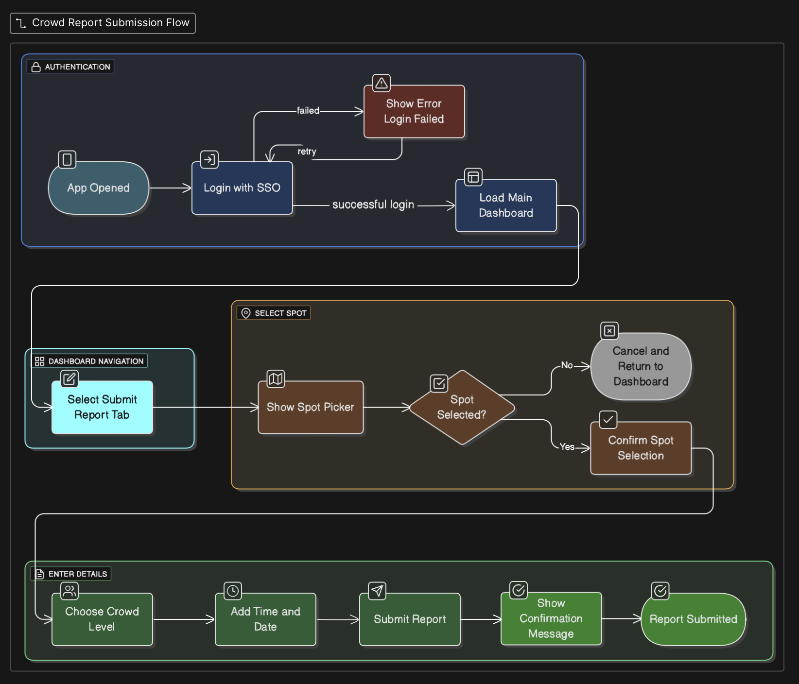

# Specification Phase Exercise

A little exercise to get started with the specification phase of the software development lifecycle. See the [instructions](instructions.md) for more detail.

## Team members

[Ganling Zhou](https://github.com/GanlingZ)
[Harrison]()
[Pran]()
[Zeba Shafi](https://github.com/Zeba-Shafi)

## Stakeholders

Name: Arpita D
Grade: Freshman (Undergraduate)
Residence: Third North (on-campus, not a commuter)

## Summary of Goals, Needs, and Challenges:
Arpita, a freshman living in Third North, studies on campus about three days a week
Top study locations include: Bobst Library (lower level floords), Kimmel lounges, and Third North common areas.

Main challenge is the unpredictability of study space availability. She stated she often wasted time walking to places like Bobst or Kimmel only to find them overcrowded, particularly during peak class hours (11am-4pm). On one occasion, she spent over 20ish minutes trying to find a seat in Bobst but was unsuccessful. This cuts into her productive time between classes.

Expressed a strong interest in using an app that provides real-time updates on study space accessibility and crowd levels, saying it would help her plan her day more efficiently so she can go to the right buildings at the right time. Also mentioned that information on available charging outlets would be valuable, since her laptop often runs out of battery during long study sessions (P2 use case).

## Takeaways:
1) Needs real-time crowd level updates to avoid wasted time.
2) Wants study spot details (e.g., quiet vs. group spaces, outlet availability).
3) Would actively use an app to improve her campus study experience.

<!-- See instructions. Delete this line and replace with the name(s) of the stakeholder(s) you interviewed and lists showing their goals/needs, and problems/frustrations.

//freshman

//undergraduate

//graduate 

questions: 
*Name/grade/communte or not

*What is your general experience in finding a study space on campus?

*What are your top study spaces on campus?

*How many days in a week would you study on campus?

*Have your had a specific experience that you had trouble finding an avaible spot to study on campus?

*If you have the option to, would you use an APP to check the accesbility of a study space on campus?

*Any additional information to add -->

## Product Vision Statement
**StudyScape** is an app whose goal is to aide NYU students to have a reference on how accessible a study space is in real time based on student reports. 

## User Requirements

1) As a freshman student, I want to quickly find study spaces on campus so that I can adjust to university life and establish effective study habits in my new environment.

2) As a student with long breaks between classes, I want to see which study spots are currently available so that I can use my downtime productively without wasting time searching for space.

3) As a study-abroad student new to this campus, I want to explore and compare how crowded different study spaces are so that I can easily discover good places to study without prior local knowledge.

4) As a student who wants to snack, I want access to food-friendly spaces so that I can stay energized while studying.

5) As a student who has a disability, I want accessible facilities so that I can comfortably and independently participate in academic life.

6) As a student who needs to charge my laptop, I want sufficient charging stations so that I can continue working without interruption.

7) As a student who has a big workload, I want quiet and supportive study environments so that I can focus and manage my tasks efficiently.

8) As a student who wants to help others find space, I want to submit a quick crowd report (with optional details/photo) so that the app shows up-to-date conditions for everyone.

## Activity Diagrams

### User Story 8: As a student who wants to help others find space, I want to submit a quick crowd report (with optional details/photo) so that the app shows up-to-date conditions for everyone.

### User Story 2: As a student with long breaks between classes, I want to see which study spots are currently available so that I can use my downtime productively without wasting time searching for space.

## Clickable Prototype

## Diagram Pages:

#### Screens

- 

- 

- 

- 

- 

- 

- 

#### Overlays

- 

- 

- 

- 

- 

----------------------------------------------------------------
## TIMELINE(Sept 22nd means Sept 22nd 11:59pm EST, etc)
Sept 22nd Interview/User story uploaded
Sept 24th UML Diagram(Pran)
Sept 26th WireFrame Diagram 
Sept 28Th Presentation Slides and Rehearsal

We aim to get everything by Saturday night. 
And we loosely say Sunday evening to rehearse presentation. 

